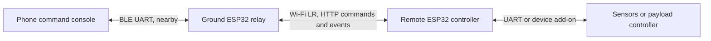

# ESP32 Wi-Fi Long Range and a Bluetooth ground relay

Both ESP32 controller projects support `WiFiLR:ON` and `WiFiLR:OFF`. OFF is the
default, including migration from configurations saved by older firmware. LR is
a separate setting from transmit power: `WiFiTxPower:MAX` still means the
configured 19.5 dBm ceiling; enabling LR changes the Wi-Fi protocol.

## What can connect?

ON selects **LR only** on every enabled Wi-Fi interface. Both ends need an
LR-capable Espressif chip. A phone, laptop, or ordinary router cannot join the
LR access point. Even mixed BGN+LR on an ESP32 AP does not solve phone access,
because that AP sends its beacons in LR. See Espressif's
[LR compatibility guide](https://docs.espressif.com/projects/esp-idf/en/v5.4.2/esp32/api-guides/wifi.html#lr-compatibility).

Use two classic ESP32 boards (the repository's ESP-WROOM-32/LOLIN32 is a suitable
starting point). ESP32-C2 does not support LR. ESP8266 is not an LR peer. The
relay sketch below specifically targets classic ESP32 with Wi-Fi and BLE, using
Arduino-ESP32 3.x. Main firmware rejects unavailable LR commands and reports
driver failures rather than silently using ordinary Wi-Fi.

LR retains IP networking: the controller's HTTP command API and event stream
still work over the ESP32-to-ESP32 link. It is not LoRa or ESP-NOW. Espressif
specifies raw LR rates of 250/500 kbit/s; useful application throughput is lower.
Range depends on antennas, placement, interference, and clear line of sight.
Treat the advertised kilometer-scale range as a test condition, not a guarantee.
See [Espressif's LR guide](https://docs.espressif.com/projects/esp-idf/en/v5.4.2/esp32/api-guides/wifi.html#long-range-lr).

## Phone → BLE relay → LR remote controller



The remote board runs either of this repository's controller projects. The
ground board runs [ESP32_LR_BLE_Relay.ino](../examples/ESP32_LR_BLE_Relay/ESP32_LR_BLE_Relay.ino).
Commands travel from BLE RX to `/api/command`; `/api/events` supplies replies and
Wi-Fi-targeted telemetry to BLE TX. This is an application relay, not a general
network bridge: it does not proxy a website, OTA upload, or arbitrary IP traffic.
Loading the HTML console on the phone is a separate step.

### 1. Configure the remote over USB

Upload the updated controller firmware. Open its USB serial monitor at 115200
baud, with newline line endings. Use your own AP password on both boards; the
following values are bench examples matching the relay's defaults:

```text
WiFiMode:AP
WiFiApSSID:ESP32-LR-Remote
WiFiApPassword:lrbench123
WiFiTxPower:MAX
WiFiLR:ON
ConfigSave
ConfigApply
```

These commands assume the active boot profile uses Wi-Fi. If `RadioStatus`
reports `bootActive=BLE`, `SPP`, or `USB`, send `ModeWiFi` after configuring and
saving the settings. That command performs the existing managed profile reboot;
wait for `[BOOT][RADIO][OK]`, then inspect `RadioStatus` again.

After the apply grace period, `RadioStatus` should show `wifiLRDesired=on`,
`wifiLRActive=on`, Wi-Fi mode AP, and address `192.168.4.1`. `ConfigRead` also
reports `lrDesired` and `lrActive`. State JSON and `/api/state` include LR status.
An active LR setting confirms the protocol configuration; it does not prove
that a distant peer is connected or that packets are being delivered.

APSTA also enables LR on both interfaces. Its station cannot connect to an
ordinary home router in LR-only mode. For this topology choose AP on the remote
and STA on the relay. Wi-Fi fallback APs also use the selected protocol.

### 2. Upload the ground relay

1. Open `examples/ESP32_LR_BLE_Relay/ESP32_LR_BLE_Relay.ino` in Arduino IDE.
2. Select a classic ESP32 board and an application partition with room for both
   Wi-Fi and BLE (LOLIN32: Minimal SPIFFS, `PartitionScheme=min_spiffs`).
3. Install **ArduinoJson 7.x** using Library Manager. Wi-Fi, HTTPClient, and BLE
   come with the Espressif Arduino core; the relay does not need AsyncTCP or
   ESPAsyncWebServer.
4. Set `REMOTE_SSID`, `REMOTE_PASSWORD`, and `REMOTE_URL` at the top of the sketch
   to match the remote. Keep `http://192.168.4.1` for the default AP address.
5. Upload to the ground board and open its serial monitor at 115200 baud. Look
   for `[RELAY] LR connected ip=...`. USB commands on this board also go to the
   remote, so a laptop can test the LR path without Bluetooth.

The relay enables LR on its STA interface **before** association. It uses
automatic Wi-Fi reconnect, maximum configured TX power, a separate network
worker, bounded queues, and 20-byte BLE notifications. BLE and Wi-Fi share radio
airtime; measure performance with BLE connected, not just with USB testing.

### 3. Connect a phone

Use a BLE UART client that supports the Nordic UART Service, or the existing
controller web console's **Connect BLE** button. The relay advertises
`ESP32-LR-Relay` and uses the same service/characteristics as the firmware:

| Purpose | UUID |
| --- | --- |
| Service | `6E400001-B5A3-F393-E0A9-E50E24DCCA9E` |
| RX: write commands | `6E400002-B5A3-F393-E0A9-E50E24DCCA9E` |
| TX: subscribe to notifications | `6E400003-B5A3-F393-E0A9-E50E24DCCA9E` |

Connect, enable TX notifications, and write `Ping\n` to RX. Then try
`RadioStatus\n` or `ConfigRead\n`. Fragment long writes into 20-byte chunks and
terminate each command with a newline. The maximum line is 255 bytes. A
`[RELAY][ACK]` means HTTP accepted the command; inspect subsequent remote events
for its execution result. Remote commands, including `ConfigApply`, affect the
remote controller, not the relay's Wi-Fi configuration.

For the browser console, serve the project's `web/standalone_console.html` from
an HTTPS origin and open it in a browser with Web Bluetooth support. The page
must be loaded before communicating over BLE; the LR link cannot serve the page
directly to the phone. Browser and phone support varies; a native BLE UART
client is the fallback. The console's transport is BLE to the relay and its
command log receives remote replies. Browser `@STATE` requests fetch a compact
remote HTTP snapshot; the BLE indicators describe the local relay connection.
The snapshot includes dispenser settings, saved routine buttons, and coordinate
sequence status when the remote runs the dispenser firmware. Large snapshots
take several seconds at the deliberately paced BLE notification rate; state
polls are coalesced. Stop commands clear the relay's pending command queue.
Build and save initial routines over USB at the bench, then use their named Run
buttons over BLE/LR. The relay can accept the builder's seven commands, but
offline or slow links discard commands after four seconds and report errors;
verify the saved button/readback before running. A link loss discards partial
input; send a newline, then resend a complete command after reconnecting.

For add-on telemetry meant for the phone relay, publish it to Wi-Fi or all
transports on the remote. `SendWiFi:<text>` is a useful bench check. `SendBLE`
targets the remote board's own BLE connection, not the relay.

## A second ESP32 without the example sketch

A second board running the controller firmware can join the remote's AP:

```text
WiFiMode:STA
WiFiFallbackAP:OFF
WiFiStaSSID:ESP32-LR-Remote
WiFiStaPassword:lrbench123
WiFiLR:ON
ConfigSave
ConfigApply
```

Use a Wi-Fi boot profile as above. This establishes the LR network, but **does
not automatically forward** that board's BLE commands to the remote. For
forwarding, use the relay example or implement an HTTP client in your add-on.
Initialize a current event cursor by GETting `/api/events?limit=1`, POST one
newline-delimited text command to `/api/command` with a unique `X-Request-ID`,
then poll `/api/events?since=<cursor>&limit=2`. Responses contain `events`,
`cursor`, `gap`, and `more`; each event's `t` field contains its text.

## Restore ordinary phone Wi-Fi

Use the **remote board's USB serial port**, or its BLE link if its boot profile
includes BLE:

```text
WiFiLR:OFF
ConfigSave
ConfigApply
```

After the apply grace period, the AP uses ordinary Wi-Fi again. OFF does not
change the SSID, password, or TX power. `ConfigDefaults` also restores LR OFF
but resets the other radio settings. Reflashing alone may retain saved LR ON
because settings live in NVS. If the relay commands the remote to switch LR
OFF, the relay's LR-only link will disconnect; use USB for the next setup.

## Bench checks and limitations

1. Verify that a fresh/default configuration reports LR OFF and that a phone
   can still join its ordinary AP.
2. Enable LR over USB. Confirm desired and active LR status, and that an ordinary
   phone cannot join that AP. Join with the relay and test `Ping` in both directions.
3. Connect phone BLE; test `RadioStatus`, fragmented writes, and `SendWiFi` output.
4. Restart both boards and verify saved settings, reconnect, and fresh event
   delivery. Disconnect/reconnect BLE and check for input/output error notices.
5. Take the remote out of range on the ground. Commands received offline or
   queued for more than four seconds are discarded; commands are never retried
   automatically after an uncertain HTTP delivery. Reconnect and send a fresh
   `Ping`. Check USB logs for event gaps or dropped output.
6. Restore LR OFF over USB and confirm ordinary Wi-Fi works again. Separately
   test LR STA timeout/fallback and APSTA if your application uses them.

The example polls at one-second intervals and sends small batches. It reports
bounded-queue overflow, trims oversized output, and starts at the latest remote
event cursor after reconnect, so some disconnected-period telemetry is omitted.
Increase neither telemetry rate nor polling rate until measuring heap, latency,
and event loss with both radios active.

The relay's BLE UART uses the repository's unauthenticated command model; any
nearby connected BLE client can send commands. Before field use, add an
application-specific authorization policy if commands need restricted access.
For a drone, keep flight stabilization, link-loss handling, and actuator safety
on the onboard controller. This example is for payload commands and modest
telemetry; it has no flight-control failsafe or guaranteed command latency.
The implementation and bench procedure require hardware validation before use
on an aircraft.
